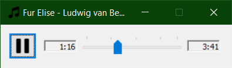

# windows-audio-service

## Аудіо сервіс
Аудіо сервіс - програма/плеєр для прослуховування аудіофайлів на комп'ютері.

Функціонал

1. **Перегляд аудіофайлу**
Можливість переглядати аудіофайл, який прямо зараз відтворюється в плеєрі
Отримання інформації про файл (назва, артист, тощо)

2. **Відтворення аудіо**
Програвання обраних аудіо файлів

3. **Пауза аудіо**
Можливість ставити відтворюваний аудіофайл на паузу 

4. **Індикатор поточного часу аудіофайлу**
Можливість переглядати, яка секунда аудіофайлу відтворюється прямо зараз

5. **Загальний індикатор часу файлу**
Можливість переглядати, яка загальна довжина аудіофайлу, який прямо зараз відтворюється

6. **Перемотування**
Можливість перемотати айдіофайл на будь-яку секунду

7. **Регулювання гучності**
Можливість регулювати гучність аудіо


SetTimer(hDlg, 123, MS / 4, nullptr): Цей виклик створює таймер з ідентифікатором 123 для головного вікна діалогу hDlg. Таймер буде викликатися кожні MS / 4 мілісекунд (де MS визначено як 1000), що приблизно дорівнює чвертині секунди.

SendMessage(hDlg, WM_TIMER, 0, 0): Цей виклик надсилає головному вікну повідомлення WM_TIMER, що зазвичай використовується для опрацювання таймерів. У цьому випадку він викликає обробник подій, який оновлює стан відтворення медіа та інтерфейс користувача.

TrackBar_SetTicFreq(hPosition, 60): Ця функція встановлює частоту відображення позначок на слайдері для відтворення медіа. У вашому коді вона встановлює кожну 60-ту позначку на слайдері.

TrackBar_SetLineSize(hPosition, 10): Ця функція встановлює розмір кроку переміщення відтворення медіа на слайдері. У вашому коді вона встановлює розмір кроку переміщення на 10 одиниць.

TrackBar_SetPageSize(hPosition, 60): Ця функція встановлює розмір сторінки для переміщення відтворення медіа на слайдері. У вашому коді вона встановлює розмір сторінки переміщення на 60 одиниць.

TrackBar_SetTicFreq(hVolume, 10): Аналогічно до пункту 3, ця функція встановлює частоту відображення позначок на слайдері для регулювання гучності.

TrackBar_SetLineSize(hVolume, 1): Аналогічно до пункту 4, ця функція встановлює розмір кроку переміщення на слайдері для регулювання гучності.

TrackBar_SetPageSize(hVolume, 10): Аналогічно до пункту 5, ця функція встановлює розмір сторінки переміщення на слайдері для регулювання гучності.

TrackBar_SetRange(hVolume, 0, 100): Ця функція встановлює межі значень для слайдеру гучності від 0 до 100 одиниць.

TrackBar_SetPos(hVolume, 100 - 100): Ця функція встановлює початкове значення на слайдері гучності, яке відповідає максимальному рівню гучності (у вашому випадку - 100).


//////////////////////////////////////================//////////////////////////////////////////

// MCI (Media Control Interface) - це високорівнева інтерфейсна бібліотека 
// для управління мультимедійними пристроями в операційних системах Microsoft
// Windows. Вона дозволяє програмам відтворювати і записувати аудіо та відео файли,
// управляти CD/DVD-ROM, MIDI пристроями і іншими мультимедійними ресурсами. 
// MCI надає набір команд, які можуть бути використані для управління цими 
// пристроями через функції mciSendCommand або mciSendString.

### 1. Створення модального вікна

Модальне вікно створюється за допомогою функції `DialogBox`. У нашому випадку це відбувається у функції `_tWinMain`:

```cpp
int WINAPI _tWinMain(HINSTANCE hInstance, HINSTANCE, LPTSTR, int)
{
    // Initialize common controls
    InitCommonControls();

    // Display the main dialog box
    return DialogBox(hInstance, MAKEINTRESOURCE(IDD_PLAYER), nullptr, PlayerDlgProc);
}
```

- **hInstance**: дескриптор екземпляра програми.
- **MAKEINTRESOURCE(IDD_PLAYER)**: ідентифікатор ресурсу діалогового вікна (IDD_PLAYER).
- **nullptr**: дескриптор батьківського вікна (немає).
- **PlayerDlgProc**: вказівник на функцію обробки повідомлень для діалогового вікна.

### 2. Програвання та зупинка музики

Програвання і зупинка музики здійснюється через функції `MciPlay` та `MciPause`, які викликаються в обробнику повідомлень для кнопки `IDC_PLAY`:

```cpp
void PlayerDlgOnCommand(HWND hDlg, int id, HWND hWndCtl, UINT codeNotify)
{
    const PlayerDlgData* pData = (PlayerDlgData*)GetWindowLongPtr(hDlg, DWLP_USER);

    switch (id)
    {
    case IDC_PLAY:
    {
        DWORD_PTR dwMode = MciGetStatus(hDlg, pData->wDeviceID, MCI_STATUS_MODE);
        if (dwMode == MCI_MODE_PLAY)
            MciPause(hDlg, pData->wDeviceID);
        else
            MciPlay(hDlg, pData->wDeviceID);
    }
    break;

    case IDCANCEL:
        break;
    }
}
```

- **MciPlay**: виконує команду MCI_PLAY, яка починає відтворення музики.
- **MciPause**: виконує команду MCI_PAUSE, яка призупиняє відтворення музики.

### 3. Оновлення трекбару

Трекбар оновлюється у функції обробки повідомлення `WM_TIMER`:

використовує MCI команду `setaudio` для зміни гучності.

```cpp
void PlayerDlgOnTimer(HWND hDlg, UINT id)
{
    static bool bRecursive = false;
    if (bRecursive)
        return;

    bRecursive = true;

    PlayerDlgData* pData = (PlayerDlgData*)GetWindowLongPtr(hDlg, DWLP_USER);
    const HWND hPosition = GetDlgItem(hDlg, IDC_POSITION);

    DWORD_PTR dwMode = pData->wDeviceID != 0 ? MciGetStatus(hDlg, pData->wDeviceID, MCI_STATUS_MODE) : MCI_MODE_NOT_READY;

    if (!pData->bTracking && dwMode == MCI_MODE_PLAY)
    {
        DWORD dwPosition = (DWORD)MciGetStatus(hDlg, pData->wDeviceID, MCI_STATUS_POSITION) / MS;
        TrackBar_SetPos(hPosition, dwPosition);
        TCHAR buf[100];
        FormatTime(dwPosition, buf, ARRAYSIZE(buf));
        SetWindowText(GetDlgItem(hDlg, IDC_BEGIN), buf);
    }

    bRecursive = false;
}
```

- **TrackBar_SetPos**: встановлює позицію трекбару.
- **MciGetStatus**: отримує поточну позицію відтворення з пристрою MCI.
- **FormatTime**: форматує час у вигляді рядка для відображення на інтерфейсі.

### 4. Регулювання гучності

Гучність регулюється функцією `MciSetVolume`:
Використовується таймер, який створюється функцією `SetTimer` для генерації подій через певні проміжки часу.
   - При кожному таймерному події відправляється повідомлення `WM_TIMER`, яке обробляється у відповідній функції.
   - У функції обробки `WM_TIMER` оновлюється поточний час відтворення та стан кнопок відтворення/призупинення.

```cpp
void MciSetVolume(HWND hDlg, MCIDEVICEID wDeviceID, DWORD dwVolume)
{
    TCHAR buffer[1024];
    _stprintf_s(buffer, ARRAYSIZE(buffer), _T("setaudio %s volume to %d"), DEF_ALIAS, dwVolume);

    TCHAR ret[1024];
    MCIERROR e = mciSendString(buffer, ret, ARRAYSIZE(ret), hDlg);
    if (e != MMSYSERR_NOERROR)
        MciShowError(hDlg, e);
}
```

- **MciSetVolume**: відправляє команду `mciSendString`, яка встановлює гучність аудіопристрою.

### 5. Робота з аудіофайлами (відкриття, закриття)

Відкриття і закриття аудіофайлів виконується функціями `MciOpen` та `MciClose`:

```cpp
MCIERROR MciOpen(HWND hDlg, MCIDEVICEID& wDeviceID, LPCTSTR pFileName)
{
    MciClose(hDlg, wDeviceID);

    MCI_OPEN_PARMS op = {};
    op.dwCallback = MAKELONG(hDlg, 0);
    op.lpstrElementName = pFileName;
    op.lpstrAlias = DEF_ALIAS;
    MCIERROR e = mciSendCommand(wDeviceID, MCI_OPEN, MCI_WAIT | MCI_OPEN_ELEMENT | MCI_OPEN_ALIAS, (DWORD_PTR)&op);
    if (e != MMSYSERR_NOERROR)
    {
        MciShowError(hDlg, e);
    }
    else
    {
        wDeviceID = op.wDeviceID;
    }
    return e;
}

void MciClose(HWND hDlg, MCIDEVICEID& wDeviceID)
{
    if (wDeviceID != 0)
        MciGeneric(hDlg, wDeviceID, MCI_CLOSE);
    wDeviceID = 0;
}
```

- **MciOpen**: відкриває аудіофайл і асоціює його з MCI-пристроєм.
- **MciClose**: закриває MCI-пристрій.

### 6. Іконки

Іконки завантажуються у функції `PlayerDlgOnInitDialog`:

```cpp
BOOL PlayerDlgOnInitDialog(HWND hDlg, HWND hWndFocus, LPARAM lParam)
{
    PlayerDlgData* pData = new PlayerDlgData;
    SetWindowLongPtr(hDlg, DWLP_USER, (LONG_PTR)pData);

    HICON hIcon = (HICON)LoadImage(GetModuleHandle(NULL), MAKEINTRESOURCE(IDI_PLAYER), IMAGE_ICON, 0, 0, LR_DEFAULTCOLOR | LR_DEFAULTSIZE);
    SendMessageW(hDlg, WM_SETICON, ICON_BIG, (LPARAM)hIcon);

    pData->hIcoPlay = (HICON)LoadImage(GetModuleHandle(NULL), MAKEINTRESOURCE(IDI_PLAY), IMAGE_ICON, 0, 0, LR_DEFAULTCOLOR | LR_DEFAULTSIZE);
    pData->hIcoPause = (HICON)LoadImage(GetModuleHandle(NULL), MAKEINTRESOURCE(IDI_PAUSE), IMAGE_ICON, 0, 0, LR_DEFAULTCOLOR | LR_DEFAULTSIZE);

    // Additional initialization code
    return TRUE;
}
```

- **LoadImage**: завантажує іконки з ресурсів програми.
- **MAKEINTRESOURCE(IDI_PLAYER)**, **MAKEINTRESOURCE(IDI_PLAY)**, **MAKEINTRESOURCE(IDI_PAUSE)**: ідентифікатори ресурсів іконок.

Таким чином, код створює інтерфейс для програвання музики з функціональністю програвання, паузи, налаштування гучності та оновлення трекбару.


//API functions//


### Windows API функції

1. **DialogBox**:
   ```cpp
   return DialogBox(hInstance, MAKEINTRESOURCE(IDD_PLAYER), nullptr, PlayerDlgProc);
   ```
   Використовується для створення модального діалогового вікна.

2. **SendMessage**:
   ```cpp
   SendMessage(hDlg, WM_TIMER, 0, 0);
   ```
   Використовується для відправлення повідомлень вікну або віконному елементу управління.

3. **SetDlgItemText**:
   ```cpp
   SetDlgItemText(hDlg, IDC_BEGIN, buf);
   ```
   Використовується для встановлення тексту в елемент керування діалогового вікна.

4. **GetDlgItem**:
   ```cpp
   const HWND hPosition = GetDlgItem(hDlg, IDC_POSITION);
   ```
   Використовується для отримання дескриптора елемента управління в діалоговому вікні.

5. **SetWindowLongPtr** / **GetWindowLongPtr**:
   ```cpp
   SetWindowLongPtr(hDlg, DWLP_USER, (LONG_PTR)pData);
   ```
   Використовується для встановлення або отримання значення довгого типу, пов'язаного з вікном.

6. **LoadImage**:
   ```cpp
   HICON hIcon = (HICON)LoadImage(GetModuleHandle(NULL), MAKEINTRESOURCE(IDI_PLAYER), IMAGE_ICON, 0, 0, LR_DEFAULTCOLOR | LR_DEFAULTSIZE);
   ```
   Використовується для завантаження зображення (наприклад, іконки) з ресурсу.

7. **SetWindowText**:
   ```cpp
   SetWindowText(hDlg, buf);
   ```
   Використовується для встановлення тексту в заголовок вікна.

8. **GetModuleHandle**:
   ```cpp
   HICON hIcon = (HICON)LoadImage(GetModuleHandle(NULL), MAKEINTRESOURCE(IDI_PLAYER), IMAGE_ICON, 0, 0, LR_DEFAULTCOLOR | LR_DEFAULTSIZE);
   ```
   Використовується для отримання дескриптора модуля, який завантажив поточний виконуваний файл.

9. **EnableWindow**:
   ```cpp
   EnableWindow(hPlay, pData->wDeviceID != 0);
   ```
   Використовується для включення або відключення вікна або елемента управління.

10. **MessageBox**:
    ```cpp
    MessageBox(hDlg, TEXT("Couldn't open media file!"), TEXT("Error!"), MB_ICONERROR | MB_OK);
    ```
    Використовується для відображення діалогового вікна повідомлення.

11. **DragQueryFile**:
    ```cpp
    DragQueryFile(hDrop, i, buf, ARRAYSIZE(buf));
    ```
    Використовується для отримання інформації про файли, перетягнуті у вікно.

12. **GetWindowText**:
    ```cpp
    GetWindowText(hDlg, pData->strTitle, ARRAYSIZE(pData->strTitle));
    ```
    Використовується для отримання тексту заголовка вікна.

13. **EndDialog**:
    ```cpp
    EndDialog(hDlg, ERROR_SUCCESS);
    ```
    Використовується для закриття діалогового вікна.

### MCI (Media Control Interface) API функції

1. **mciSendCommand**:
   ```cpp
   MCIERROR e = mciSendCommand(wDeviceID, uMsg, MCI_WAIT, (DWORD_PTR)&gp);
   ```
   Використовується для відправлення команд MCI пристрою. У коді використовуються різні команди для відкриття, закриття, відтворення, паузи, перемотування і отримання статусу медіапристрою.

2. **mciSendString**:
   ```cpp
   MCIERROR e = mciSendString(buffer, ret, ARRAYSIZE(ret), hDlg);
   ```
   Використовується для відправлення команд MCI у вигляді рядка.

3. **mciGetErrorString**:
   ```cpp
   mciGetErrorString(e, buf, ARRAYSIZE(buf));
   ```
   Використовується для отримання текстового опису коду помилки MCI.


   //Macros// Макроси

   Макроси в C/C++ використовуються для заміни тексту на певний код під час препроцесора. Розглянемо кожен з наданих макросів та пояснимо, що вони роблять і як спрощують обробку повідомлень у віконних процедурах.

### Макрос HANDLE_DLGMSG

```c
#define HANDLE_DLGMSG(hwnd, message, fn) \
    case (message): \
        return (SetDlgMsgResult(hwnd, message, \
            HANDLE_##message((hwnd), (wParam), (lParam), (fn))))
```

Цей макрос використовується для обробки повідомлень діалогового вікна. Він призначений для спрощення коду віконної процедури, забезпечуючи єдиний формат для обробки різних повідомлень. 


- **`hwnd`**: дескриптор вікна.
- **`message`**: повідомлення, яке обробляється.
- **`fn`**: функція, яка буде викликана для обробки цього повідомлення.

Макрос вставляє код, який відповідає на повідомлення `message`, викликаючи відповідну функцію обробки і встановлюючи результат за допомогою `SetDlgMsgResult`.


### Макрос HANDLE_WM_SYSCOMMAND

```c
#undef HANDLE_WM_SYSCOMMAND
#define HANDLE_WM_SYSCOMMAND(hwnd, wParam, lParam, fn) \
    ((fn)((hwnd), (UINT)(wParam), (int)(short)LOWORD(lParam), (int)(short)HIWORD(lParam)))
```

Цей макрос обробляє системні команди (наприклад, коли користувач натискає на кнопку закриття вікна).

- **`hwnd`**: дескриптор вікна.
- **`wParam`**: додаткові параметри повідомлення.
- **`lParam`**: додаткові параметри повідомлення.
- **`fn`**: функція обробки, наприклад `Cls_OnSysCommand`.

Макрос викликає функцію `fn` з відповідними параметрами, перетворюючи `lParam` на дві окремі координати `x` і `y`, використовуючи `LOWORD` і `HIWORD`.


### Макрос HANDLE_WM_APPCOMMAND

```c
#define HANDLE_WM_APPCOMMAND(hwnd, wParam, lParam, fn) \
    ((fn)((hwnd), (HWND)(wParam), GET_APPCOMMAND_LPARAM(lParam), GET_DEVICE_LPARAM(lParam), GET_KEYSTATE_LPARAM(lParam)), TRUE)
```

Цей макрос обробляє повідомлення `WM_APPCOMMAND`, яке надсилається, коли користувач натискає клавіші мультимедійного управління на клавіатурі або іншому пристрої.

- **`hwnd`**: дескриптор вікна.
- **`wParam`**: додаткові параметри повідомлення (часто дескриптор дочірнього вікна).
- **`lParam`**: додаткові параметри повідомлення, що містять код команди, пристрій і стан клавіш.
- **`fn`**: функція обробки, наприклад `Cls_OnAppCommand`.

Макрос викликає функцію `fn` з відповідними параметрами, витягуючи значення з `lParam` за допомогою `GET_APPCOMMAND_LPARAM`, `GET_DEVICE_LPARAM` і `GET_KEYSTATE_LPARAM`. Після виклику функції обробки повертається `TRUE`, вказуючи, що повідомлення оброблене.

### Висновок

Ці макроси спрощують код віконних процедур, дозволяючи замість численних `case` і перетворень параметрів використовувати більш компактний і читабельний код.



